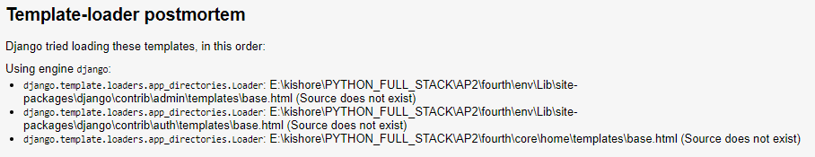

in this the app  are accounts core home 

app is like which contains all the modules of project 

django app are reusable 
bootup means start or runserver 

if u want to run ur project on particular port u can do the followig 
0.0.0.0:5000
 each 0 represent the 8 bit character ie is 32 bit character
 with column 5000 represent the port number 

how to start with the html response in django that  we know it should be done in template folder 
how to return the data from backend 
  

there are two types of view one is class based and another one function based view

frontend file that is html file should be inside the templates 
- check the spelling of templates and put all ur frontend file insde this 

js file should be  writtain with the html file 
    
    to send the data from backend to template we use context 


    ```
           
            <tr>
                <!-- <td></td> -->
                <!-- <td>1</td> instead of doing this we can dynamically couner the value -->
                <td>{{forloop.counter}}</td>
                <!-- for loop counter is used to dynamically change the value -->
                <td>{{p.NAME}}</td>
                <!-- <td>3</td> -->
                <!-- <td>{{p.age}}</td>
                 -->
                <td>{{p.AGE}}</td>


            </tr>
            
    ```
    THis behave like for loop which is writin inside %%  and ended with the for end  and we can see teh logic writain with the name p 

    when u dont reuere the thing dont comment it just delete it 
    ```
           <!-- <td  style="background-color:green"  style="background-color:greenyellow"  style:"background-color:red">                   ✔ -->
    ```


    in oop we should notrepeate the same code again and again
this results redundant nature  this concept  is called DRY means do not reapte urself 
     
     for this wecan use block tag of django 
    

#### TemplateDoesNotExist at /about/



context={'title':'contact'}  it should be in single quote 

whatever writtain above the <% block block_name %> is copied and accessible everywhere 

<% blockend %> 
code writtain below this is also accessible everywhere     

and code writtain inside the block tag cannot be accessible everywhere 


#### models and migration
