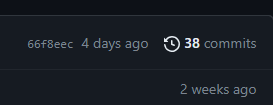

in this the app  are accounts core home 

app is like which contains all the modules of project 

django app are reusable 
bootup means start or runserver 

if u want to run ur project on particular port u can do the followig 
0.0.0.0:5000
 each 0 represent the 8 bit character ie is 32 bit character
 with column 5000 represent the port number 

how to start with the html response in django that  we know it should be done in template folder 
how to return the data from backend 
  

there are two types of view one is class based and another one function based view

frontend file that is html file should be inside the templates 
- check the spelling of templates and put all ur frontend file insde this 

js file should be  writtain with the html file 
    
    to send the data from backend to template we use context 


    ```
           
            <tr>
                <!-- <td></td> -->
                <!-- <td>1</td> instead of doing this we can dynamically couner the value -->
                <td>{{forloop.counter}}</td>
                <!-- for loop counter is used to dynamically change the value -->
                <td>{{p.NAME}}</td>
                <!-- <td>3</td> -->
                <!-- <td>{{p.age}}</td>
                 -->
                <td>{{p.AGE}}</td>


            </tr>
            
    ```
    THis behave like for loop which is writin inside %%  and ended with the for end  and we can see teh logic writain with the name p 

    when u dont reuere the thing dont comment it just delete it 
    ```
           <!-- <td  style="background-color:green"  style="background-color:greenyellow"  style:"background-color:red">                   ✔ -->
    ```


    in oop we should notrepeate the same code again and again
this results redundant nature  this concept  is called DRY means do not reapte urself 
     
     for this wecan use block tag of django 
    

#### TemplateDoesNotExist at /about/


context={'title':'contact'}  it should be in single quote 

whatever writtain above the <% block block_name %> is copied and accessible everywhere 

<% blockend %> 
code writtain below this is also accessible everywhere     

and code writtain inside the block tag cannot be accessible everywhere 

```
https://docs.djangoproject.com/en/4.2/ref/templates/language/#template-inheritance
```
### filter 
means filter the text in upper lower or else by using a pipe(|)
- {{text|lower}}
- {{text|upper}}
- {{text|escape|linebreaks|truncatewords:30}}
- {{list|join:","}}
* to convert the list text to string 
the output of one filter can apply to next 


#### models and migration
schema is like structure 
like student is the name of structure in that what name age class marks are attriute 
this is called the structure 

```
class Person(models.Model):
    first_name = models.CharField(max_length=30)
    last_name = models.CharField(max_length=30)
```
first name and last name are the field of model,each field are the attribute of a class and each attribute are maps to a database column 
each attribute maps to a database column  


    # t hsi is the primary key which is autogenerated 
    # primary key is thekey which is used to uniquely identify the records of a table ti  isunique andnot null
bydefault database of django is the sqlite 
for thsi first we have to make the schema also called the modes 
this is done in models.py which recides in every app 

inside the models.py create the models by using the class 
```
class name_of_models(models.Model):
    field1 
    field2
    field3
    .
    .
    .
    fieldn 

```        
##### migrations are the the process of managing changes to the database schema 
if u alter the db schema u have to enter the command python manage.py makemigrations
aftere this the new file is created with the dependency in it as app name and with the previous init file 

to push this changes or save this data in to the db we have to enter the command 
python manage.py migrate  


the important things in this is that dont delte the dependency even after saving the main file in db 
in every theere is folder of migration which is used 
wirte the command as * python manage.py make *


when we hit the command the python manage.py migrate 
it will run all the migrations file and and make the states and that states are compare  with the db schema and whichever there it will make the chages 


<!--  -->

## django shell
django shell allow u to interact with the django project 
it load all the django project setting database 
its essentially a python interpreter with ur django project 

to work with the shell u have to enter the command 
```
python manage.py shell 
```
In models.py there are two shemas one is student and another one is the Product 


 # image=models.ImageField(null=True)
    # file=models.FileField()
we can insert the data into database using two ways one is 
using the name of the model direcly pass the value 
```
In [1]: from home.models import *

In [2]: st=User(name="kjlk",email="s@gmail.com",age=23,address="lkjflaskdjf",)

In [3]: st
Out[3]: <User: User object (None)>

In [4]: st.save()

In [5]: st
Out[5]: <User: User object (1)>
```

or second one is by using the object which is also called the model manager 
```
 user=User.objects.create(name="lksjd",email="K@gmail.com",age=23,address="kjfaksjdhf kasjhdfkajsh")

In [7]: user
Out[7]: <User: User object (2)>

```
in this u dont have to enter the save command 


to run any file directly which is the part of django project it is not possible 
but we can do this in django shell 
    to open the django shell  python manage.py shell 
    in that shell first import the file and just write the function name  to  execute 

crud operation 

## CREATE
we can inset the data using 
 car_obj={"car_name":"nexon","speed":90}
asteric Car.objects.create(**car_obj)


 car_obj={"car_name":"nexon","speed":90}

  c=Car.objects.create(car_name="ghoraGari",speed=10)

c=Car(car_name="bmw",speed=80)
In [8]: c

### RETRIEVE 
CAR.OBJECTS.ALL()

 for  i in range(2):
    ...:     print(f"name of the car is :{Car.objects.all()[i].car_name} and the id is :{Car.objects
    ...: .all()[i].id} and their speed is:{Car.objects.all()[i].speed}"
    ...: 
    ...:     )
    ...: 
name of the car is :bmw and the id is :1 and their speed is:80
name of the car is :ghoraGari and the id is :2 and their speed is:10

Car.objects.get(id=1)
Out[24]: <Car: Car object (1)>

get method is used to fetch the details 

filter is used when u dont have the data basically when u are not source that the data is there that time u got with the filter it will return the empty array if it doesnot got the data
### update
 Car.objects.filter(id=1).update(car_name="using filter")
Out[13]: 1

In [14]: Car.objects.filter(id=2).update(car_name="using update")
Out[14]: 1

In [15]: Car.objects.all()
Out[15]: <QuerySet [<Car: using filter>, <Car: using update>, <Car: nexon>]>


In [3]: c=Car.objects.get(id=1)

In [4]: c
Out[4]: <Car: bmw>

In [5]: c.car_name="khudka kagadi"

In [6]: c
Out[6]: <Car: khudka kagadi>

## Delete
delete
do not perform delete operation on any stage because on production nothing to be deleted 
c=Car.objects.get(id=1).delete()

to delete all the record we use   
Car.objects.all().delete()  
it will  delete allur record  
```
Recipe.objects.filter(id__in=[6,7,8,9]).delete()  
Out[12]: (4, {'vegetable.Recipe': 4})  

```

to create the new migrations 
enter teh command 
```
python manage.py makemigrations
```
##### but before creting hte migrations makesure the app name should be there in project ka main folder ke settting.py ke installed app ke andar

after logging if u want to go to next page u should enter be aware of e.preventdefault()
and 
* location.href="src_next_page_link" 


## while extending the base.html make sure where or in 
which app it is present and target that file by giving back slash 

## to send the data from frontend to backend we use post method 


if u want to upload the image u need to type enctyp as multipart/form-data in form tag like 
```
    <form class="container mx-auto card" method="post" enctype="multipart/form-data">

```
if u dont use this u are not able to upload the image all the text field will be uploaded except the image field 

```
from django.shortcuts import render
from django.http import HttpRequest
# Create your views here.
def recipe(request):
    if request.method=="POST":
        data = request.POST
        # print(f"recipe name is {data['name']}")
        print(f"recipe name is {data.get('name')}")


    return render(request,"recipe.html",context={"title":"recipe"})
```
for textual data we have post  method 
request.post  but to recieve the file we have to use 
request.FILES['receipe_image']

```
reciptImage=request.FILES.get('iamge')
```
how to store the image in db or print in the console and how to send theimage from  frontend and  store it in dbs 


to save the models in the database we use 

with the help of context we can send data from backend to fronend 


when i wanted to show the images on web which is coming from backend or databases 
for that i have to create the new folder called public and for this i have to insert some amount of line of code in settings.py 

like STATIC_ROOT
MEDIA_ROOT 
static_url 
media_url 

```
import os
# STATIC_ROOT='staticfiles'
STATIC_URL = '/static/'

STATIC_ROOT=os.path.join(BASE_DIR, 'staticfiles')

STATICFILES_DIR={
    os.path.join(BASE_DIR,"public/static")
}

MEDIA_ROOT = os.path.join(BASE_DIR,'public/static')
MEDIA_URL='/media/'
```
after writing this line of code ull get an error for that u have tomake changes in url 

add this url 
```
if settings.DEBUG:
    urlpatterns += static(settings.MEDIA_URL,document_root=settings.MEDIA_ROOT)

urlpatterns +=staticfiles_urlpatterns()
```
and do not forger to imoprt the settings from ur project folder and static from 
```
from django.conf.urls.static import static
```

### sometime when u dont get the result after writing clear code just restart the code and this concept is called "murkhak laathi banjhe kapaar"

like i did when i not get the image after creating all the public folder like public\static\recipe

```
http://127.0.0.1:8000/media/recipe/193-866x9562.jpg
```
when someone  move to  the media file django understand and it will sends the media file related context like image video and file like pdf an all 

some important question related to this django 
how  to send the data from backend to frontend 
        to send the data from backend to frontend we use context and whatever we passed through context it can executabel in frontend 
        this is in object format 
        to use that in frontend we have to use that as  varibale using {{write the name of the key used in the context}}

how to send the data from frontend to backend 
    to send the data from  frontend to backend we use action in the from data and sepcially to send the image from frontend to backend we use enctype="mltipart/form-data"

how to handle the dynamic route in django 
    for that we have to use the two parameter in the django 

```    
def delete_recipe(request,id):
    print(id)
    return HttpResponse("sleep")
```        
in button 
  <a href="/delete-recipe/{{i.id}}/">delete</a>
  delete-recipe is the route where request and id will be returning the so that dynamic id is the 
  key attribute 
  logic for deleting the data from dbs are 
  def delete_recipe(request,id):
    a=Recipe.objects.get(id=id)
    <!-- dbs automatically generate the id for each field -->
    a.delete()
    return redirect("/recipe/)
## u can access the object value ka value using the dot notaion but to acees the value from form use the get method 


djnago handle most of things automatically such asi have wirttan the logic for accepting  teh user input such as name descsription photo and review but in that user have only passed their name and rest of the things empty and isave it so updated value should be empty na but it is not so djagno supports automatically handling 


authentication and authorisationa 
for  user authentication we are going to use predefine model from django.db.auth.moe
from django.contrib.auth.models import User 

## if u use the path like register/ it will open next to the current but when u use the /register 

&lt;a href="register/"&gt;Create an account</a>
when u click on it it will  open lik e
```
http://127.0.0.1:8000/register/
```
when u clck on it &lt;a href="register/">Create an account</a>
it  willopen like 
```
http://127.0.0.1:8000/login/register/   

```

for storing the password we have used sha algorithm to generate one time password 
##django messages


to see all the commit 


click on commit u will see all changes 
and  see accordingly whichever step u want to go 

#  advance authentication 
<!--  -->
instead of exists we can use directly conditional statement 

after one time login user shoul not  login again and again every page 
so for that we have to maintian the session 
and for session we use login which will maintian the session 


#### to solve this error pass the the argument in login() as request and the name of the user
* login(request,user)  


### ORM
object relational model 
  
## n
new field is created ,initially defautl value is set to 1 but later using random package we set the random value 
```
 for i in r:
   ...:     i.recipe_counter=random.randint(10,100)
   ...:     i.save()
   ...: 
```
to access the value in decreasing order we can use - sign 
```
    r=Recipe.objects.all().order_by(-count_recipe)
```
the result what we get is an list format so we have can perform all the list  function on it
most important that is slice 


```
 r.filter(recipe_counter=82)
 we should not use double == othewise it will give u an error as 
 recipe_counter is not defined 
```
# 
* to get teh value in sorting order we use order by 
```
    r=Recipe.objects.all().order_by(-count_recipe)
```
Recipe.objects.filter(field_name= value)
```
Recipe.objects.filter(field_name__lte=value)
Recipe.objects.filter(field_name__gte=value)

```

## we can  perform the sql on django 
model.objects.raw("write the sql statement")  